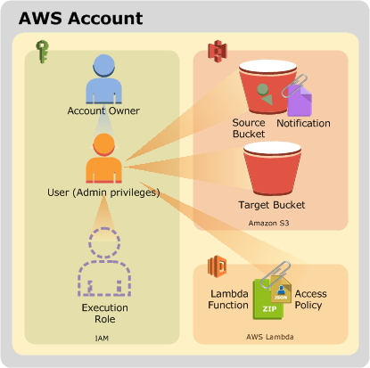

# AWS S3 Events Lambda CreateThumbnail

The `aws-s3-events-lambda-createthumbnails` project is based on the [Using AWS Lambda with Amazon S3](https://docs.aws.amazon.com/lambda/latest/dg/with-s3-example.html) tutorial provided by Amazon.

The project provides:

* Lambda function which resizes a source image into a destination thumbnail
* Lambda function is triggered by an *object create* event which is configured on a source S3 bucket
* Lambda function reads the source image from the source S3 bucket, it then resizes the image to a thumbnail size
* Lambda function writes the resulting thumbnail image to a destination S3 bucket

The project can be created and destroyed through the use of scripts which interact with the AWS CLI and the AWS SDK for JavaScript.

# Architecture overview

The project architecture is depicted in the diagram below:



The following resources are created as part of the project.

## Lambda Resources

* A Lambda function.
* An access policy associated with your Lambda function that grants Amazon S3 permission to invoke the Lambda function.

## IAM Resources

* An execution role that grants permissions that your Lambda function needs through the permissions policy associated with this role.

## Amazon S3 Resources

* A source bucket with a notification configuration that invokes the Lambda function.
* A target bucket where the function saves resized images.

# Prerequisites

* An AWS account with appropriate permissions to create the required resources
* [AWS CLI installed and configured](https://docs.aws.amazon.com/cli/latest/userguide/install-cliv1.html)
* [Node.js](https://nodejs.org/en/) (v12+) and [npm](https://www.npmjs.com/) (v6+) installed and [configured for use with AWS](https://docs.aws.amazon.com/sdk-for-javascript/v2/developer-guide/getting-started-nodejs.html)
* Bash environment in which to execute the scripts

# Deploy the project

## Grab the project 

The first step is to git clone the project.

```bash
git clone --verbose --progress https://github.com/damianmcdonald/aws-s3-events-lambda-createthumbnails aws-s3-events-lambda-createthumbnails
```

## Configure global variables

The second step is to modify any of the global variables to suit your needs.

The global variables are defined in the [aws-deploy.sh](aws-deploy.sh) script.

You will need to update the `AWS_PROFILE` variable to reflect the profile that you have configured in the AWS CLI.

For the remaining global variables, if you just want to have a sandbox environment to experiment with the project then the defaults below are probably fine.

```bash
# Global variable declarations
PROJECT_DIR=$PWD
AWS_PROFILE=<!-- ADD_YOUR_AWS_CLI_PROFILE_HERE -->
AWS_REGION=$(aws configure get region --output text --profile ${AWS_PROFILE})
AWS_ACCOUNT_ID=$(aws sts get-caller-identity --profile ${AWS_PROFILE} --query "Account" --output text)
IAM_CAPABILITIES=CAPABILITY_IAM
STACK_NAME=s3-events-lambda
S3_SOURCE_BUCKET=imagesourcedcorp${RANDOM}
S3_RESIZED_BUCKET=${S3_SOURCE_BUCKET}resized
IMAGE_FILE_DIR=${PROJECT_DIR}/images
SOURCE_DIR=${PROJECT_DIR}/src
LAMBDA_SRC=${SOURCE_DIR}/lambda
POLICIES_DIR=${PROJECT_DIR}/policies
TEST_DIR=POLICIES_DIR=${PROJECT_DIR}/test
UTIL_SRC=${SOURCE_DIR}/util
LAMBDA_ROLE_NAME=lambda-s3-role
UNDEPLOY_FILE=aws-undeploy.sh
```

## Create the resources and deploy the project

Create the resources and deploy the project by executing the [aws-deploy.sh](aws-deploy.sh) script.

```bash
./aws-deploy.sh
```

As part of the execution of the [aws-deploy.sh](aws-deploy.sh) script, four additional files are dynamically created.

Location | Purpose
------------ | -------------
test/test-event.json | JSON file that contains a mock S3 event which can be used to test the `CreateThumbnail` lambda function
src/utils/set-s3-events-autogen.js | Node.js script that uses the AWS-SDK in order to create an S3 event notification which invokes the `CreateThumbnail` lambda function on the S3 source bucket
policies/lambda-trust-policy.json | JSON file that contains the definition of the trust policy required for the lambda execution role
aws-undeploy.sh | Script that can be used to destroy and clean-up all of the resources created by the `aws-s3-events-lambda-createthumbnails` project

# Test the project

The project contains a [test event](test/test-event.json) that can be used to invoke the Lambda function.

For details on how to test a lambda function using a test event in the AWS Console, refer to https://docs.aws.amazon.com/lambda/latest/dg/getting-started-create-function.html.

The high level steps are:

1. Upload the [images/koala.jpg](images/koala.jpg) file to the source S3 bucket
2. Logon to AWS Console
3. Navigate to the Lambda service
4. Click the **Test** button in the upper right corner
5. In the **Configure** test event page, choose **Create new test event** and in **Event template** add the content of [test event](test/test-event.json). Enter an **Event** name and choose **Create**
6. AWS Lambda executes your function on your behalf. The handler in your Lambda function receives and then processes the sample event.
7. Upon successful execution, view results in the console.
	* The Execution result section shows the execution status as succeeded and also shows the function execution results, returned by the return statement.
	* The Summary section shows the key information reported in the Log output section (the REPORT line in the execution log).
8. The Log output section shows the log AWS Lambda generates for each execution. These are the logs written to CloudWatch by the Lambda function. The AWS Lambda console shows these logs for your convenience.
9. Navigate to the S3 resized bucket to confirm that the koala-resized.jpg file has been created.